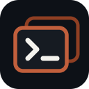

<p align="center">
  
</p>

<h1 align="center">dtach Sessions</h1>

<p align="center">
  <b>Terminal sessions that survive the disconnect.</b><br>
  Run your shells under <a href="https://github.com/crigler/dtach">dtach</a>, list them in the sidebar, reattach in a click.
</p>

---

Your SSH link drops or you reload the window, and the shell you had running is
gone along with whatever it was doing. dtach Sessions keeps it alive: every
terminal runs under dtach, shows up in the sidebar, and reattaches right where
you left off. The program inside never notices you were gone, which makes this a
good home for a long-running coding agent like Claude.

## Why dtach

dtach does one thing: it holds a program on a detachable pty and gets out of the
way. No status bar, no window manager, no config language. This extension leans
on that restraint.

Attaching a session runs `dtach -a` in an ordinary integrated terminal, so
selection, copy, scroll, and search behave like any other VS Code terminal.
Nothing is redrawn through a webview or a PTY proxy. The extension runs on the
**remote** extension host, next to your sockets and the dtach binary, so nothing
about the terminal round-trips a UI over the wire.

## Quick start

1. Install dtach on the remote host (`apt install dtach`, `brew install dtach`,
   or build from source).
2. Install the extension on that host (see [Installing](#installing)).
3. Open the **dtach Sessions** view in the activity bar and press **+**. Name the
   session; a terminal opens running your shell under dtach.
4. Close the window, drop your SSH connection, reload VS Code. Reopen the view,
   click the row, and you are back in the same session.

Point `dtachSessions.startupCommand` at `claude` (or any program) to launch it
automatically in every new session.

> The extension host does not source your `.bashrc`, so dtach may not be on its
> `PATH`. If sessions fail to open, set `dtachSessions.dtachPath` to an absolute
> path like `/home/you/.local/bin/dtach`.

## The session list

The sidebar lists every `.dtach` socket in `dtachSessions.socketDir` (default
`~/.dtach-sessions`), most recently active first. Each row shows how long ago the
session last did something. A session with a terminal open in the current window
is marked **attached** and gets a green icon; detached rows are dimmed so you can
tell at a glance which sessions this window is actually driving.

Clicking a row attaches the session. If a terminal for it is already open, VS
Code focuses that one instead of stacking a second client on the socket. The list
refreshes when you create a session, when the view becomes visible, and on the
title-bar refresh button.

## Commands

Available from a row's inline icons, its right-click menu, the view's `…` menu,
or the command palette (search "dtach Sessions").

| Command | What it does |
| --- | --- |
| **New Session** (`+`) | Prompt for a name and open a fresh shell under dtach. |
| **Attach** | Open (or focus) a terminal for the session. |
| **Switch Session** | Fuzzy-find and attach a session without leaving the keyboard. |
| **Open in Detach Session** | Right-click a folder in the Explorer to attach, or create, a session rooted there and named after it. |
| **Rename** | Move the socket and relabel the row and its terminal. The live session survives. |
| **Detach** | Close this window's terminal but leave the dtach server running. |
| **Restart** | Terminate the server and open a fresh shell under the same name, re-running `startupCommand`. Scrollback does not survive. |
| **Reap Stale Clients** | Clear orphaned dtach clients wedged on a socket (see below). |
| **Copy Socket Path** / **Copy Attach Command** | Grab either for scripting or a plain SSH session. |
| **Kill** | Terminate the server and remove its socket, with confirmation. Select several rows to kill them together, or use **Kill All Sessions**. |

Sockets are named `<prefix><name>_<hash>.dtach`. The trailing `_<hash>` is a
stable id, so a rename moves the socket without losing track of the process, and
a kill resolves the process by id rather than by name. Renamed sessions never
end up orphaned.

### Reaping stale clients

A dtach client that outlives its terminal (you closed the window, the SSH link
dropped) can wedge on the socket. Two clients then share one pty with no redraw
buffer, and the wedged one ignores `SIGTERM`, so your next attach lands on a live
cursor over a blank screen. By default an attach reaps these orphans first
(`dtachSessions.reapStaleClientsOnAttach`) so the new client owns the socket
cleanly. Reaping only ever kills clients; the session and whatever it runs keep
going. Linux hosts only.

## Coding agents and live Claude status

Running an agent CLI under dtach means it survives the disconnects that would
otherwise kill a foreground process. dtach Sessions adds a status channel on top
of that for [Claude Code](https://claude.com/claude-code).

Run **dtach Sessions: Install Claude Status Hooks** once (or accept the one-time
prompt). It wires a small forwarder into `~/.claude/settings.json`, merging
alongside any hooks you already have; **Uninstall Claude Status Hooks** removes
only its entries. Each session row then reflects what its Claude is doing:

| State | Row shows | Meaning |
| --- | --- | --- |
| working / tool | spinner + `working` or `tool: <name>` | Claude is processing your turn. |
| waiting | amber bell + `waiting` | Claude is blocked on a tool-permission decision and needs you. |
| done | green check + `done` | Claude finished its turn. Your move. |
| idle | plain row, age only | A fresh or quiet session. |

The amber bell means a genuine permission block and nothing else, so the
**activity-bar badge** counting waiting sessions stays trustworthy even with the
view collapsed. An idle prompt (Claude waiting ~60s after a finished turn) leaves
the row on `done` rather than ringing. On a detached row the calm `done` check
mutes to grey with the dimmed label, while the urgent bell keeps its colour, so a
dim row with a bright bell reads as "dormant session that needs you".

The row's relative time becomes activity-relative while status is available
(time in state, or how long since Claude last acted) instead of the socket's
mtime. Sessions already running Claude pick up status after a restart, since
Claude reads its hooks at session start.

Linux hosts only, and the forwarder needs `python3` on the host. See the
[status note](#status-showclaudestatus) for how correlation works.

## Configuration

| Setting | Default | Description |
| --- | --- | --- |
| `dtachSessions.socketDir` | `~/.dtach-sessions` | Directory holding the sockets (`~` expands to home). Created on first session. |
| `dtachSessions.socketPrefix` | *(empty)* | Filename prefix; files are `<prefix><name>_<hash>.dtach`. See the migration note below. |
| `dtachSessions.startupCommand` | *(empty)* | Command run inside a session's shell on create (not reattach), e.g. `claude`. |
| `dtachSessions.redrawMethod` | `winch` | `-r` value on attach and create. One of `winch`, `ctrl_l`, `none`. See note below. |
| `dtachSessions.dtachPath` | `dtach` | Path to the dtach binary; set an absolute path if it is not on `PATH`. |
| `dtachSessions.reflectProcessTitle` | `true` | Let the running program's title drive the terminal tab (e.g. an agent CLI's live status). The session name still labels the sidebar row. Set `false` to pin the session name on the tab. |
| `dtachSessions.showClaudeStatus` | `true` | Show a Claude instance's live run-state (working / tool / waiting / done / idle) on each row. Needs the status hooks. Linux only. |
| `dtachSessions.reapStaleClientsOnAttach` | `true` | Reap orphaned dtach clients before attaching so the new client redraws cleanly. Disable if you deliberately attach one session from several windows. Never touches the session itself. Linux only. |

## Requirements

- **dtach** on the remote host.
- For **Kill**: `lsof` (preferred) or `pgrep`. Kill finds the owning process with
  `lsof -t <socket>`, falls back to `pgrep -f`, then removes the socket. With
  neither available it removes the socket without confirming the process is gone,
  so a live session could be left orphaned; on any Linux host that has dtach at
  least one of these is effectively always present.
- For **live Claude status** (optional): `python3` and a Linux host, since the
  forwarder reads `/proc`. Other hosts show no status and everything else works.

## Installing

Build the `.vsix`:

```sh
npm install
npm run compile          # tsc -p ./  ->  out/
npx @vscode/vsce package # -> dtach-sessions-<version>.vsix
```

Then, in a Remote-SSH window, open the Command Palette, run **Extensions:
Install from VSIX…**, and pick the file. VS Code uploads and installs it on the
remote host. Reload the remote window. Tagged builds are also attached to the
[GitHub releases](https://github.com/jjsmackay/vscode-dtach-sessions/releases).

## Notes and trade-offs

Some behaviour is inherent to running programs under a detached pty. None of it
harms the program itself.

### Redraw (`redrawMethod`)

`winch` repaints on reattach only when the terminal size differs from the size at
detach, so reattaching at the same size can leave a TUI blank until the next
resize. `ctrl_l` forces a redraw regardless of size, but it sends a literal
Ctrl-L, which some TUIs (Claude among them) read as a clear-screen keystroke.
Pick the trade-off that suits you.

### Terminal title (`reflectProcessTitle`)

VS Code only honours an escape-set tab title from a process it recognises as an
agent CLI (Claude Code, Copilot, Gemini), so the extension cannot seed the tab
itself. Resume an idle agent and the tab shows the session-name fallback until
the agent next changes state and re-emits its title.

Separately, an agent CLI running under dtach may log a VS Code IPC error and lose
editor integration after you reattach from a different window: dtach freezes the
program's environment at creation, so the `VSCODE_IPC_HOOK_CLI` socket it
inherited goes stale. Set `reflectProcessTitle: false` to just pin the session
name on the tab.

### Status (`showClaudeStatus`)

The forwarder maps each Claude session to its row by walking `/proc` from the
firing hook up to the dtach master, then reading the socket path and its
`_<hash>` id from that process's command line. Status follows a session across
rename and reattach, and works for sessions created outside the extension. It is
a no-op when nothing runs under dtach, so the host-global hook stays harmless to
your other Claude sessions. A session that exits without a clean stop (a crash, a
killed connection) decays from `working` back to its age after a couple of
minutes instead of sticking. Sessions whose socket predates the `_<hash>` scheme
show no status.

### Socket prefix migration

The default `socketPrefix` is now empty (it was `.claude-`). Sockets from older
versions are named `.claude-*.dtach` and will not appear under the new default.
Set `dtachSessions.socketPrefix` back to `.claude-` to keep seeing them, or kill
and recreate those sessions under the new naming.

## Verifying a build

No unit suite. Run through these against a build:

1. **+** → `web` creates `~/.dtach-sessions/web_<hash>.dtach`, opens a shell, and
   a `web` row appears with a relative age.
2. Click the row: a live TUI renders immediately and the row shows as attached
   (green icon).
3. With `startupCommand` set to `claude`, a freshly created session auto-runs it.
4. Rename `web` → `api`: the socket becomes `api_<hash>.dtach`, the row and
   terminal relabel, and the session stays live.
5. Kill `api`: the process is gone (`pgrep -f _<hash>.dtach` finds nothing) and
   the socket is removed. Renaming did not orphan it.
6. Reload the remote window, click a session: it reattaches.
7. Select several rows → Kill, or Kill All from the `…` menu: all gone.
8. Drag-select and right-click copy work natively in the attached terminal.

## Licence

MIT
